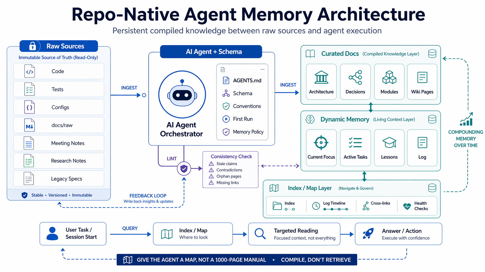

# RepoAtlas

**Give your AI agent a map of the project, not a 1000-page manual.**

[中文](README.zh.md)

---



## Why this exists

Working with coding agents usually means **short context windows** and **no durable memory**: every new session starts cold. The model forgets what you decided last week, which traps you already hit, and what the team agreed the “current focus” should be. You re-explain the same constraints again and again.

**RepoAtlas is a memory system for your repository** — not chat history, but **compiled** knowledge that lives next to your code: a thin project map, decision records, a pitfall notebook, task state, and an append-only log. The agent **updates** this layer as work happens, so later sessions pick up where the last one left off instead of rediscovering everything from zero.

- **Existing (brownfield) projects:** Add the harness **without changing application code**. Copy `AGENTS.md`, `project-memory/`, and merge the framework under `docs/`. Run the first-time bootstrap (`docs/agent/FIRST_RUN.md`) and you’re set — minimal friction, maximum continuity.
- **New (greenfield) projects:** Drop the same files in from day one and let the memory layer grow with the codebase.

No database. No embedding server. No infrastructure. Just markdown files and a clear protocol.

---

## The Problem

Every time you start a new chat with an AI coding agent, it starts from zero. It re-reads your code, re-discovers your architecture, and re-learns the lessons you already taught it last week. There's no accumulation. Knowledge is re-derived on every session, never compiled.

## The Solution

RepoAtlas applies the **"compile, don't retrieve"** pattern to code engineering. Instead of treating each session as a fresh RAG query over your repo, the agent incrementally builds and maintains a persistent knowledge layer — structured, interlinked, and always current.

The agent does the bookkeeping. You do the engineering.

---

## How It Works

### Three Layers

```
┌─────────────────────────────────────────┐
│  Raw Source Layer                        │
│  code, tests, configs, docs/raw/        │
│  (immutable — agent reads, never edits) │
├─────────────────────────────────────────┤
│  Curated Docs Layer                     │
│  docs/architecture/                     │
│  docs/decisions/                        │
│  docs/modules/                          │
│  (long-lived, agent-maintained)         │
├─────────────────────────────────────────┤
│  Dynamic Memory Layer                   │
│  project-memory/                       │
│  current-focus, tasks, lessons, log     │
│  (hot state, frequently updated)        │
└─────────────────────────────────────────┘
```

### Three Operations


| Operation  | What it does                                                                                                               | When                                                                                                                              |
| ---------- | -------------------------------------------------------------------------------------------------------------------------- | --------------------------------------------------------------------------------------------------------------------------------- |
| **Ingest** | Agent reads sources (code, chat conclusions, `**docs/raw/`**), extracts durable knowledge, updates memory and curated docs | After meaningful code work; after new or updated files in `docs/raw/` (user-triggered); first run also compiles existing raw docs |
| **Query**  | Agent loads just enough context for the current task via layered reading profiles                                          | Every session start, every task                                                                                                   |
| **Lint**   | Agent health-checks the memory layer for staleness, contradictions, orphan docs                                            | After heavy changes, or when drift is suspected                                                                                   |


---

## Two Archetypes, Auto-Detected

Not every project is application code. RepoAtlas supports two project archetypes out of the box — **same framework, two default curated shapes**:

| Archetype | Use it for | Primary truth | Default curated layer |
| --- | --- | --- | --- |
| `code` | Application / engineering projects | code and tests | `docs/architecture/`, `docs/modules/`, `docs/decisions/` |
| `docs-kb` | Knowledge base, research notes, docs compilation — you drop files into `docs/raw/` and the agent builds curated knowledge | raw docs under `docs/raw/` | `docs/topics/`, `docs/concepts/`, `docs/glossary.md`, `docs/summaries/`, `docs/decisions/` |

The three-layer structure, the Ingest / Query / Lint operations, and all operational manuals stay the same. Only the truth-priority order, the default scaffolding, and some change-level examples differ.

**You do not declare archetype manually.** `project-memory/source-roots.md` ships with `Archetype: auto`. On the first session, the agent inspects your repo (package manifests, populated `src/`, the shape of `docs/raw/`, etc.) using the rubric in [`docs/agent/archetypes/detection.md`](docs/agent/archetypes/detection.md), writes the detected value back, and moves on. It only asks you when signals are genuinely ambiguous. You can hard-set the value any time to override; setting it back to `auto` retriggers detection.

For `docs-kb`, also see [`docs/agent/archetypes/docs-kb.md`](docs/agent/archetypes/docs-kb.md) — it is the authoritative reference for that archetype.

---

## Quick Start

### 1. Add to your project

Copy or clone this framework into your existing repository:

```bash
# Option A: Clone and copy
git clone https://github.com/Jinbo666/RepoAtlas
cp -r RepoAtlas/{AGENTS.md,docs,project-memory} /path/to/your/project/

# Option B: Use as a template on GitHub
# Click "Use this template" on the repo page
```

It is **non-invasive** for application code and configs: you add `AGENTS.md`, `project-memory/`, and the framework files under `docs/`.

**If you already have a `docs/` folder:** many projects already use `docs/` for their own documentation. RepoAtlas uses conventional subpaths such as `docs/agent/`, `docs/architecture/`, `docs/decisions/`, `docs/modules/`, and `docs/raw/`. Simply **copy or merge** this repository’s `docs/` contents into your project’s `docs/`—no need to replace your existing docs; only these subfolders are required for the harness.

### 2. First Run

Tell your AI agent:

> Read `docs/agent/FIRST_RUN.md` and initialize the project.

That's it. The agent will:

1. Scan your repository structure
2. Classify source roots (code, tests, configs, raw docs)
3. Create a thin project map (architecture overview, module graph, invariants)
4. Initialize the memory layer (current focus, task scaffold, log)
5. **Register and compile** anything already in `docs/raw/`: extract durable knowledge into architecture / decisions / modules / lessons as appropriate, update `source-registry.md`, and log `ingest` entries (see `docs/agent/FIRST_RUN.md` step 7)
6. Write a bootstrap log entry

### 3. Normal Work

After initialization, just start working. The agent reads `AGENTS.md` at the start of each session, which routes it to:

1. `project-memory/current-focus.md` — what matters now
2. `project-memory/tasks/active.md` — what's in progress
3. `docs/architecture/system-overview.md` — how the system works

The agent loads only what it needs and stops early. No 1000-page context dump.

### 4. Feed Your Raw Docs

Have design docs, meeting notes, research notes, legacy specs, or pitfall writeups? Drop them into:

```
docs/raw/
```

The framework treats `docs/raw/` as **immutable source material**. The agent reads from it but **never edits** those files.

- **First run:** `FIRST_RUN.md` tells the agent to compile existing `docs/raw/` content into the curated layer (not just list filenames).
- **Later:** Ingestion does **not** run on every session. When you add or change raw docs, say something like *"Process the new files in docs/raw/"* or *"Follow AGENTS.md and ingest docs/raw/…"*. The agent follows the **Raw Doc Ingestion Protocol** in `docs/agent/memory-update-policy.md` (also linked from `AGENTS.md` under Updates).

---

## What Gets Built Over Time

As you work with the agent across sessions, the memory layer accumulates:

- **Project Map** — `source-roots.md`, `system-overview.md`, `module-graph.md`
- **Decision History** — `docs/decisions/DEC-0001-*.md` with context, alternatives, rationale
- **Pitfall Notebook** — `recent-lessons.md` with root cause, prevention rules, graduation lifecycle
- **Current State** — `current-focus.md` with priorities, risks, next actions
- **Session Log** — `log.md` with timestamped entries of what changed and why

Each lesson has a lifecycle: `active` → `cooling` → `graduated` (into architecture/decisions) or `retired`. The knowledge compounds, but the hot layer stays lean.

---

## File Structure

```
your-project/
├── AGENTS.md                          # Entry point — the map (< 70 lines)
├── docs/
│   ├── raw/                           # Your raw source documents (immutable)
│   ├── agent/
│   │   ├── FIRST_RUN.md               # First-time bootstrap guide
│   │   ├── index.md                   # Agent operation docs navigation
│   │   ├── context-loading.md         # How to load just enough context
│   │   ├── memory-update-policy.md    # When and what to compile
│   │   ├── lint-and-health.md         # Health check protocol
│   │   └── templates/                 # Reusable templates
│   │       ├── decision-note.md
│   │       ├── lesson-note.md
│   │       ├── module-note.md
│   │       ├── session-note.md
│   │       └── task-note.md
│   ├── architecture/                  # System shape (generated on first run)
│   ├── decisions/                     # Durable technical decisions
│   └── modules/                       # Module boundary docs
└── project-memory/
    ├── current-focus.md               # Dashboard — priorities, risks, next actions
    ├── tasks/
    │   ├── active.md                  # Current work
    │   ├── backlog.md                 # Not yet started
    │   └── done.md                    # Completed
    ├── recent-lessons.md              # Hot-layer pitfall notebook
    ├── log.md                         # Chronological update log
    ├── index.md                       # Memory navigation index
    ├── source-roots.md                # Repository root classification
    └── source-registry.md             # Raw doc processing tracker
```

---

## Usage Tips: What's Automatic vs. What You Say

Most of the framework runs silently. Here's what you actually need to do (and what you don't):

### Session start — you say nothing

Tools like Cursor, Claude Code, Codex, and Windsurf **automatically read `AGENTS.md`** when a session begins. The agent then follows the routing chain (`current-focus.md` → `active.md` → `system-overview.md`) on its own. You just start working.

If the context window is nearly full or the agent seems "lost", a quick reset helps:

> Re-read AGENTS.md and reload the current state.

### During work — reading is automatic, writing needs a nudge

The agent is good at **reading** memory (loading context, checking lessons). But it rarely **writes** back unprompted — updating log, lessons, or focus feels like "extra work" to the model.

**You don't need to prompt after every change.** Only at meaningful checkpoints:


| When                               | What to say                                                     |
| ---------------------------------- | --------------------------------------------------------------- |
| Fixed a bug with a reusable lesson | *"Record this in recent-lessons and log."*                      |
| Made a technical decision          | *"Create a decision note for this."*                            |
| End of a productive session        | *"Update project memory: log, current-focus, any new lessons."* |
| Periodic health check              | *"Run a lint pass on the memory layer."*                        |
| New or updated docs in `docs/raw/` | *"Ingest docs/raw/ (or this file: …)."*                         |


Tiny changes (typo fixes, formatting) need nothing.

### The rule of thumb

**Reading is implicit. Writing needs a one-liner from you.** As models improve, even this will become automatic — the protocol is already defined and waiting.

---

## Compatibility

Works with any AI coding agent that reads markdown files:

- [Cursor](https://cursor.sh) — reads `AGENTS.md` as workspace rules
- [Claude Code](https://docs.anthropic.com/en/docs/claude-code) — reads `AGENTS.md` as project context
- [OpenAI Codex](https://openai.com/index/openai-codex/) — reads `AGENTS.md` as agent instructions
- [Windsurf](https://windsurf.com) — reads `AGENTS.md` as project rules
- Any agent that can read files from the repo

No vendor lock-in. It's just markdown.

---

## Inspiration

This project is inspired by two key ideas:

- **[LLM Wiki](https://gist.github.com/karpathy/442a6bf555914893e9891c11519de94f)** by Andrej Karpathy — the pattern of having LLMs build and maintain a persistent, compounding knowledge base instead of re-deriving knowledge from scratch on every query. RepoAtlas adapts this from personal knowledge management to code engineering: the "wiki" becomes a project memory layer; "ingest" becomes compilation of code changes, debugging lessons, and design decisions; "lint" becomes truth maintenance against the living codebase.
- **[Harness Engineering](https://openai.com/zh-Hans-CN/index/harness-engineering/)** by OpenAI — the practice of building structured harnesses (AGENTS.md, docs, conventions) that give AI agents the context they need to work effectively on real codebases. RepoAtlas provides a ready-made harness starter that any project can adopt.

---

## License

MIT