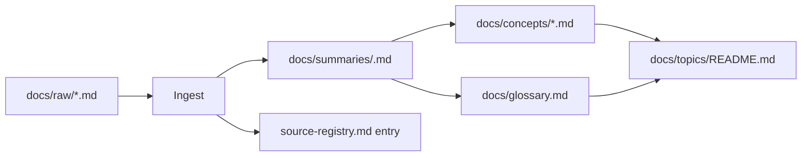

# Archetype: docs-kb

## Purpose

This page is the **authoritative reference** for the `docs-kb` project archetype.

Use this archetype when the repository is primarily a **knowledge base / documentation / research notes / compiled reading** project — that is, the main job is:

1. Put raw human-authored documents into `docs/raw/`
2. Have the agent compile them into curated, cross-linked knowledge
3. Keep the knowledge layer aligned as raw docs evolve

There is little or no application code. The **raw docs themselves are the primary source of truth**, not code.

The default archetype is `code`. Use `docs-kb` only when it is declared explicitly in `project-memory/source-roots.md`.

---

## How This Archetype Is Resolved

Archetype is auto-detected, not hand-declared.

1. `project-memory/source-roots.md` ships with `Archetype: auto`.
2. On the first agent session, the detection rubric in [`docs/agent/archetypes/detection.md`](detection.md) runs. When the repository contains substantive `docs/raw/` content and no real code signals, detection resolves to `docs-kb`.
3. The agent writes the resolved value back into `source-roots.md` and logs one `archetype-detect` entry. Subsequent sessions read the stored value and skip detection.
4. A user may hard-set `Archetype: docs-kb` (or `code`) to override detection. A user may also set it back to `auto` to trigger re-detection.

Everything below assumes the resolved value is `docs-kb`.

---

## Source of Truth (docs-kb)

Under this archetype, the priority order is:

1. Raw docs under `docs/raw/` (and other raw source roots)
2. Current user instruction
3. Curated docs (`docs/topics/`, `docs/concepts/`, `docs/glossary.md`, `docs/summaries/`, `docs/decisions/`)
4. Old project memory / session notes

There is **no code / tests / runtime** layer above raw docs. Do not invent one. If the agent finds itself looking for "what does the code actually do", it is in the wrong archetype.

If a curated conclusion contradicts the current raw doc, update the curated conclusion. If an older raw doc has been superseded, mark it `superseded` in `source-registry.md` rather than silently overwriting derived curated docs.

---

## Curated Layer Shape (docs-kb)

Default scaffolding. FIRST_RUN generates these on initialization:

- `docs/topics/README.md`
  Topic map. The knowledge-base analog of `system-overview.md`. Lists the major topics the corpus covers, how they relate, and where to enter.

- `docs/topics/<topic>.md` (created lazily)
  Per-topic pages created only when a topic accumulates enough material to justify its own page.

- `docs/concepts/README.md`
  Index of key concept cards.

- `docs/concepts/<concept>.md` (created lazily)
  One card per durable concept: short definition, key claims, references to the raw docs that establish it, related concepts.

- `docs/glossary.md`
  Flat term → one-line definition list. Every non-obvious term used across the corpus belongs here.

- `docs/summaries/README.md`
  Index of compressed per-raw-doc summaries.

- `docs/summaries/<raw-doc-slug>.md` (one per ingested raw doc)
  Compressed summary of a single raw document: what it is, key takeaways, what it contradicts or supersedes, pointers to the concepts / topics it feeds.

- `docs/decisions/` (kept from default framework)
  Editorial / structural decisions: "merge these two concepts", "split this topic", "deprecate this strand of the corpus", "accept raw doc A over raw doc B when they conflict".

**Not generated under docs-kb:**
- `docs/architecture/` — no system to diagram
- `docs/modules/` — no module boundaries

If the user later decides some part of the knowledge base needs formal structural docs, those folders can still be created on demand — they are just not default.

---

## Ingest Is the Main Operation

Under `code` archetype, ingest is an occasional operation triggered when a new raw doc arrives. Under `docs-kb`, **ingest is the main workflow**. Most sessions will be:

- "I added files to `docs/raw/`, compile them"
- "I revised `docs/raw/foo.md`, re-ingest"
- "I deprecated `docs/raw/bar.md`, propagate the supersession"

The **Raw Doc Ingestion Protocol** in `docs/agent/memory-update-policy.md` is authoritative for the steps. Under `docs-kb` add these defaults:

- Every ingested raw doc gets **at least one entry in `docs/summaries/`**, even if short. This guarantees every raw doc has a curated landing point.
- Every ingested raw doc is registered in `source-registry.md` with status `ingested` or `skipped` (never left silent).
- Concept and glossary updates flow out of summaries, not directly from raw docs — this keeps the trail traceable.

---

## Change Levels (docs-kb examples)

The tiny / medium / heavy taxonomy from `memory-update-policy.md` applies, but the examples differ:

### Tiny
- typo / wording fix in a curated doc
- fixing one glossary entry
- renaming a concept without changing meaning

Update: `log.md` only if useful.

### Medium
- ingesting one new raw doc (creates a summary, updates 1–3 concepts, maybe glossary)
- revising a concept card because the underlying raw doc was updated
- noticing that two concept cards should be cross-linked

Update: `log.md`, relevant summary / concept / glossary files, `current-focus.md` if the ingest queue shifted.

### Heavy
- restructuring the topic map
- merging or splitting concepts that were previously separate
- retiring a strand of the corpus (marking several raw docs superseded and rewriting the affected topic page)
- resolving a conflict between raw docs with an editorial decision

Update: `log.md`, `current-focus.md`, topic map, affected concepts, a decision note in `docs/decisions/`, and `recent-lessons.md` if a durable editorial rule emerged.

---

## Decisions (docs-kb)

`docs/decisions/` is used for **editorial / structural** choices under this archetype. Create a decision note when:

- two raw docs conflict and one is chosen as authoritative
- a previously accepted claim is reversed
- the topic map is restructured
- a concept is merged with or split from another
- a long-standing editorial rule is adopted ("Always compile dates in ISO format", "Never quote raw doc X verbatim, only summarize")

Do **not** create decision notes for routine ingests.

---

## Lessons (docs-kb)

`project-memory/recent-lessons.md` under `docs-kb` collects **editorial pitfalls**, not debugging lessons. Examples:

- "Raw doc X uses term T ambiguously; always disambiguate before ingesting"
- "Source A and source B disagree on date D; default to A unless otherwise noted"
- "When ingesting translated material, record the translator and version"

Same lifecycle applies (active → cooling → graduated → retired). Stable editorial rules should graduate into a decision note or into `docs/topics/README.md` as a convention.

---

## Project Memory (docs-kb emphasis)

Same files, different emphasis:

- `current-focus.md` — typically "which raw-doc batch is being digested right now", which topic is under active restructuring, which conflicts are unresolved
- `tasks/active.md` — the ingest queue and editorial work in progress
- `tasks/backlog.md` — raw docs known to exist but not yet scheduled for ingestion
- `recent-lessons.md` — editorial pitfalls (see above)
- `source-registry.md` — becomes the most load-bearing file in this archetype; it tracks every raw doc's processing state

---

## Lint Checks (docs-kb specific)

In addition to generic lint items, a docs-kb lint pass checks:

- Does the topic map cover every concept and summary, or are there orphans?
- Is every raw doc registered in `source-registry.md`? Any silent additions?
- Does every `ingested` raw doc have a corresponding `docs/summaries/` entry?
- Are glossary entries aligned with concept cards (no drift in definition)?
- Do summaries still reference raw doc versions that have been superseded?
- Are there concept cards that no raw doc actually supports (orphaned claims)?

See `docs/agent/lint-and-health.md` § H for the formal list.

---

## Context Loading (docs-kb profile)

See `docs/agent/context-loading.md` profile **F. Docs-kb routine question**. Short version:

1. `project-memory/current-focus.md`
2. `project-memory/tasks/active.md`
3. `docs/topics/README.md`
4. relevant `docs/summaries/*` and `docs/concepts/*`
5. raw docs under `docs/raw/` as needed

Do not look for `docs/architecture/` or `docs/modules/` — they do not exist in this archetype.

---

## What Stays the Same as `code` Archetype

- Three-layer structure (Raw / Curated / Dynamic)
- `docs/raw/` is immutable source material
- `log.md` / `tasks/*.md` / `source-registry.md` formats
- All templates under `docs/agent/templates/`
- The Ingest / Query / Lint operation model
- The general protocol for raw doc ingestion (only the defaults and emphasis change)

---

## Quick Reference Card

| Question | Answer under docs-kb |
|---|---|
| Primary source of truth | raw docs under `docs/raw/` |
| Main curated entry page | `docs/topics/README.md` |
| Is `docs/architecture/` used? | no |
| Is `docs/modules/` used? | no |
| Is `docs/decisions/` used? | yes — for editorial / structural decisions |
| Main recurring operation | ingest |
| Every raw doc must have | a summary + a registry entry |
| What lives in `recent-lessons.md` | editorial pitfalls |
